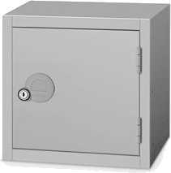

<h1> RunSomeAware</h1>

Small ransomware awareness campaign with proof of concept... 
<b>Ransomware:</b> type of malware which encrypt all your files. 
<b>Encryption:</b> simple locker which will lock specific files with a key. You can't unlock them without key.  
<b>Example:</b> Suppose I have data which contains some personal information and also an key. And I encrypt like below: 
<pre><code>
//Settings...
data = 10
key = 20

//Encryption...
data + key = 30
//You need 2 variable values to recover 3rd value.

//Decryption...
data = 30 - key 
data = 20
//You can't recover data without a key.
</code></pre>

<h2> Features:</h2>
<ul>
<li>Tiny around 5--7 KB</li>  
<li>Coded under 65 lines</li>  
<li>Allowed file extension specification.</li>  
<li>Supports .net framework v2.0---5.x</li>  
<li>Supports win7--win10 both 86/64 bit</li>   
<li>AES 32 bit encryption</li>  
</ul>

<h2> Configure:</h2>
First set these all settings in <a href="RunSomeAware.cs">RunSomeAware.cs</a> and then run <a href="compiler_v2.0.bat">compiler_v2.0.bat</a> or <a href="compiler_v4.0.bat">compiler_v4.0.bat</a>.
<ul>
<li><a href="RunSomeAware.cs#L10">Key:</a> A key to lock or unlock files.</li>  
<li><a href="RunSomeAware.cs#L11">Crypted File Extension:</a> encrypted files will use this extension. e.g <code>{ ".graysuit", ".cry" ...};</code> etc. </li>  
<li><a href="RunSomeAware/blob/main/RunSomeAware.cs#L12">ParentDirectory:</a> directory where runsomeaware start encrypting files and folders.</li>  
<li><a href="RunSomeAware.cs#L13">Allowed File Extension:</a> files with specific extension which would be encrypted and other would be skipped. e.g <code>{ ".png", ".doc", ".pdf", ... };</code> etc.</li>  
</ul>

<h2> Contributions</h2>

You can contribute by using, reporting etc. You are always welcome so never fear. 
 Before reporting any bug, verify that it does found on latest release and not listed on <a href="issues">issues</a>.

<h2> Disclaimer</h2>
We assume everyone should use it legally. Author and organisation won't be responsible in case of your crime.

<h2> Contact</h2>
<ul><li>Facebook: <a href="https://fb.com/messages/t/gray.programmerz.5"><b>gray.programmerz.5</b></a></li>
<li>Email: <b><a href="mailto:hackrefisher@gmail.com">hackrefisher@gmail.com</a></b></li>
<li>Website: <a href="https://tiplava.blogspot.com/"><b>tiplava</b></a></li>
<li>Discord: <a href="https://discord.gg/Hu5XPGMTuk"><b>Fishes</b></a></li>
</ul>
<h1>I Love ALLAH + Holy Prophet + Islam and Pakistan.</h1>
